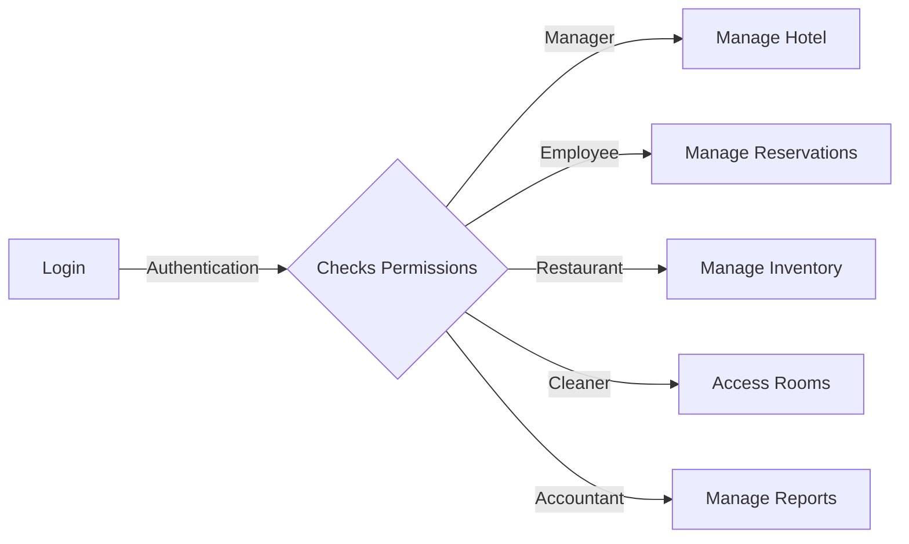

# Welcome to HotelHub!

HotelHub is a cross-platform desktop app powered by Electron. HotelHub boosts your productivity by creating a centralized environment for all hotel data and analytics.

## Features

- [ ] Reservations/Front-Desk Support
- [ ] Inventory Management
- [ ] Restaurant Invoices & Billing
- [ ] Account Reports
- [ ] Time Keeping
- [ ] Graphs of Data Analytics

## UML diagrams

HotelHub follows the following diagram convention:

## Usage

<kbd>Command/ctrl + R</kbd> - Reload

<kbd>command + q</kbd> - Quit App (while window is open).

> Before starting to publish, you must link an account in the **Publish** sub-menu.

## Built with
- Electron](https://electron.atom.io)

